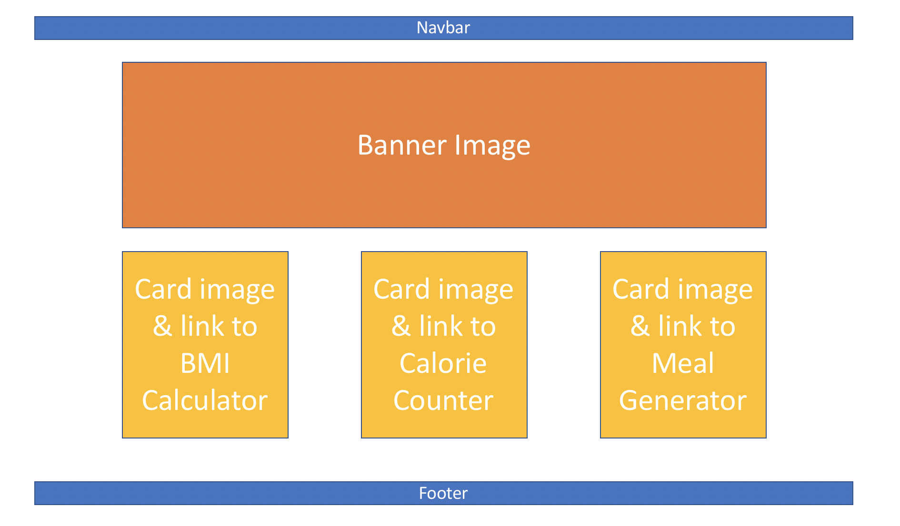
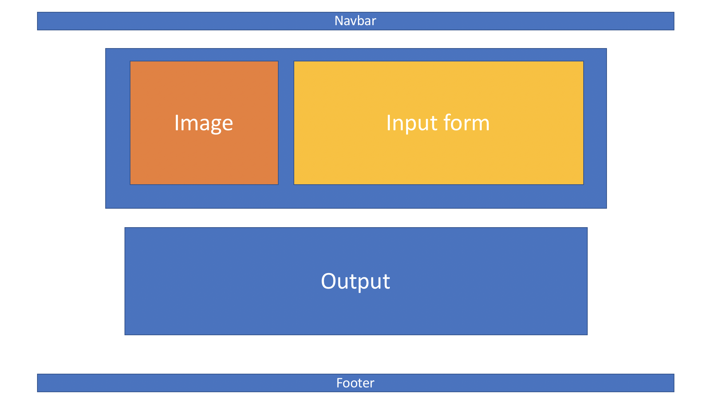
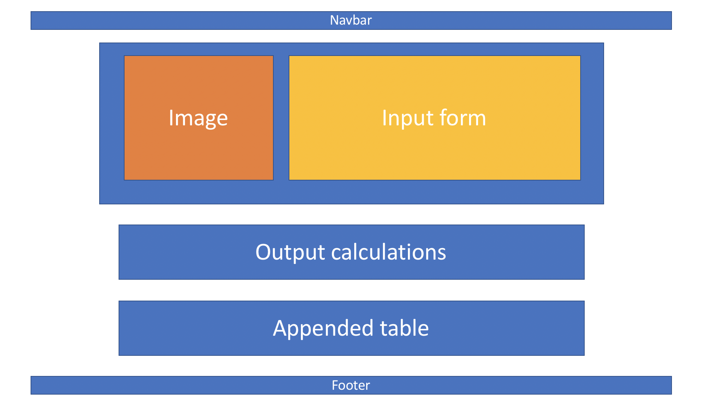
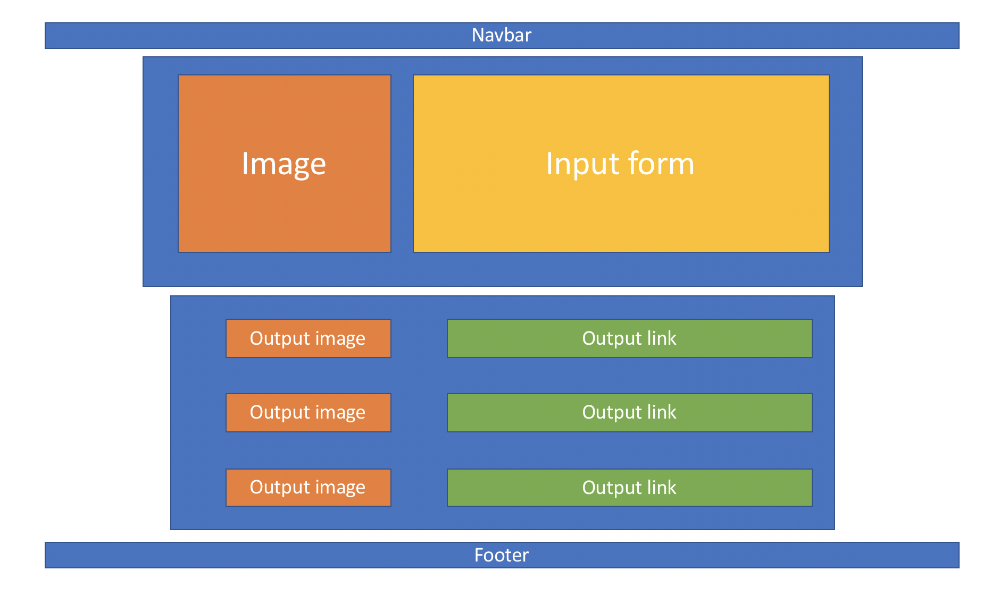
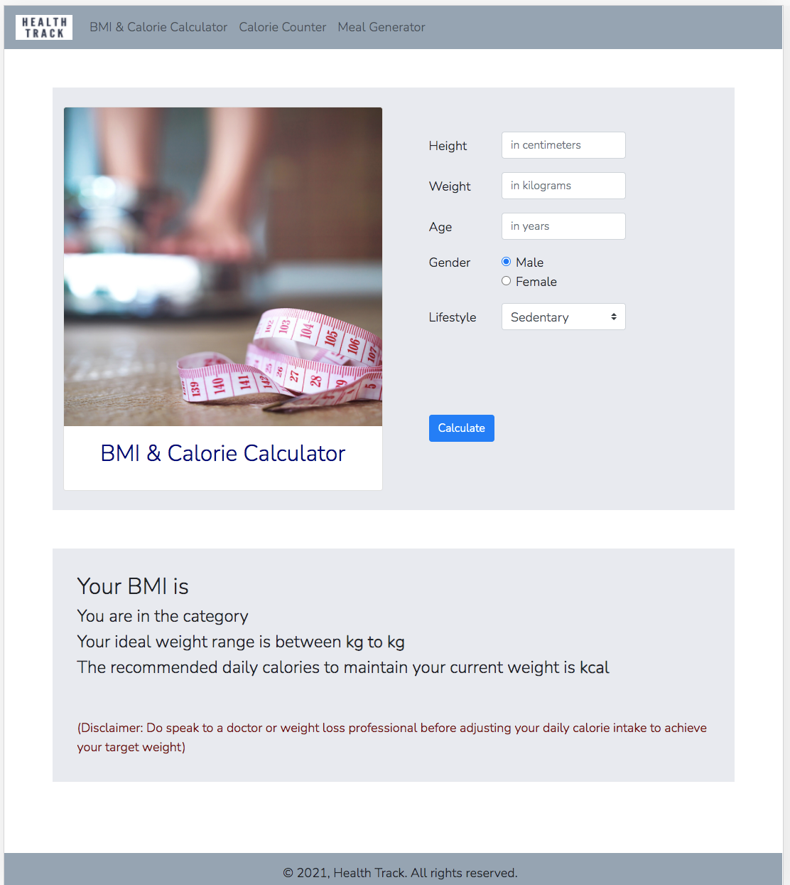
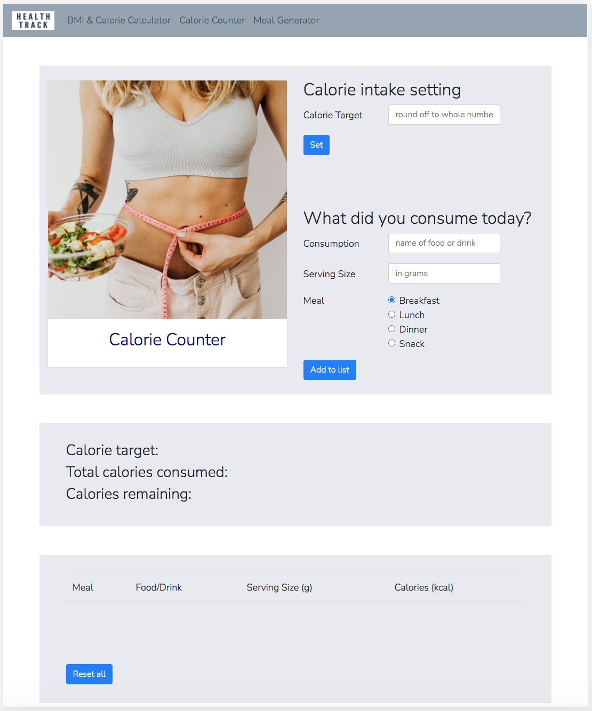
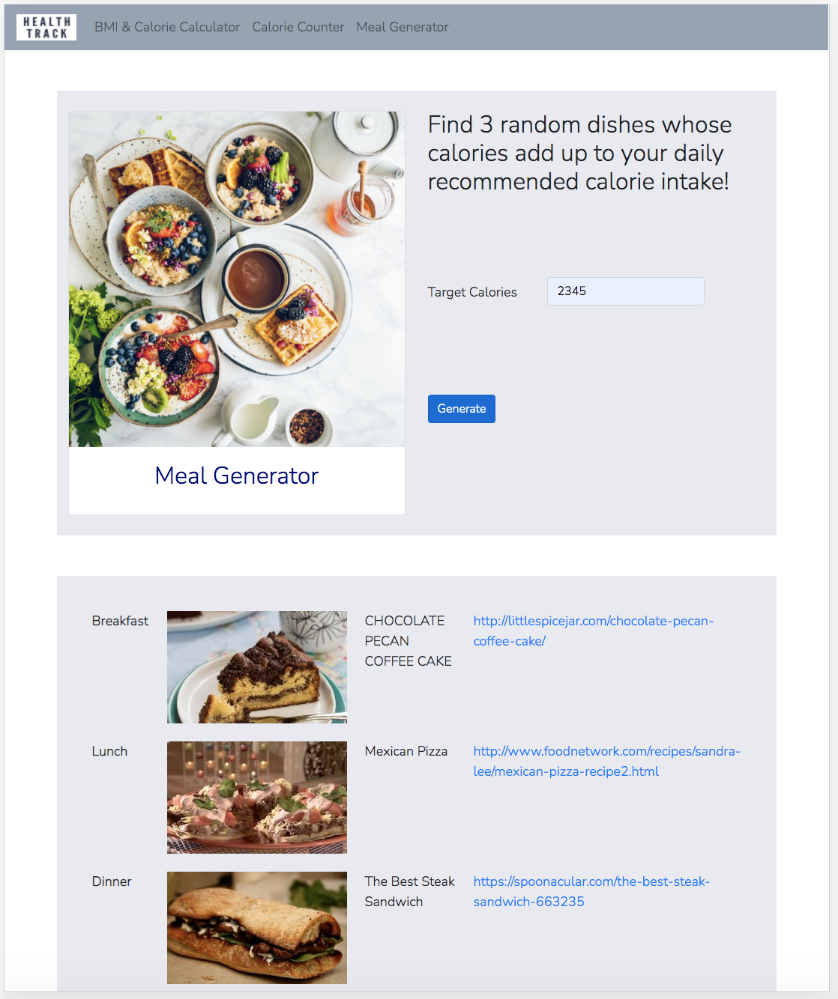
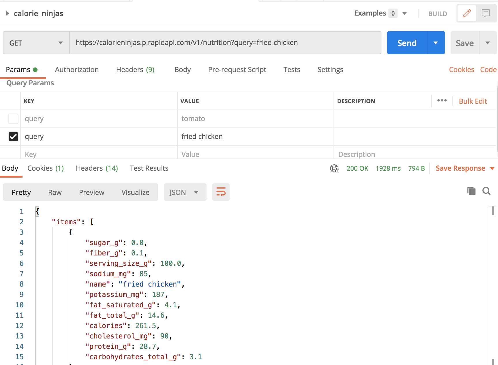

# Interactive Front-End Development - Milestone Project 2

 
### A website to monitor an individual's health and diet

# Table of Contents
1. Background
2. Objectives
3. Demo
4. Adopted Technology
5. User Stories
6. Development
7. Implementation
8. Testing
9. Deployment
10. Acknowledgement

# 1. Background
Health Track is an interactive website targeted towards users who are health-conscious. The website allows the users to find out their BMI based on their height and weight, their recommended daily calorie intake based on their age and level of activeness, monitor their calorie intake for the day, and also suggest to them some dishes that they can prepare themselves and consume based on their recommended daily calorie intake. The website will be able to assist the users in their journey to maintain a healthy lifestyle.

# 2. Objectives
* To complete Milestone Project 2 - Interactive Front-End Development.
* To build an interactive website that is able to receive user input and process the data to generate an output that is useful for the user.
* To assist health-conscious users who need to monitor their calorie intake.

# 3. Demo
View the end product: [Health Track](https://farhansam.github.io/health_track/)

# 4. Adopted Technology
* HTML/CSS
* Bootstrap v4.1.x
* Javascript/jquery
* Postman & RapidAPI (for APIs)
* Stackoverflow
* Canva
* Github

# 5. User Stories
The target audience for the website are health-conscious individuals who are interested to monitor their current state of general health and their calorie intake. Some of the user stories are:

1. I want to know my BMI to gauge whether I am in the healthy range
2. I want to know my recommended calorie intake in order to gain/maintain/lose weight
3. I want to know how many calories I have consumed today
4. I want to know if I exceeded my recommended calorie intake for the day
5. I want a recommendation of dishes that I can eat based on my recommended calorie intake
6. I want to know how the dishes look like
7. I want to know the recipe for these dishes

# 6. Development
Wireframe for respective webpages:

1. Main landing page
   

2. BMI & Calorie Intake Calculator
   

3. Calorie Counter
   

4. Meal Generator
   

5. UX js section

# 7. Implementation
Screenshot of actual webpages:

1. Main landing page
   

2. BMI & Calorie Intake Calculator
   

3. Calorie Counter
   

4. Meal Generator
   

# 8. Testing

## Functionality Testing
1. Test links

| Test Type | Test | Result | Error Fix |
|:---------:|:----:|:------:|:---------:|
| Functionality | Test navbar links among all pages | All links work | NA |
| Functionality | Test links on cards in main page | All links work | NA |
| Functionality | Test API endpoints | Endpoints work as expected | NA |
| Usability | Test API endpoints that may not exist in API database, ie; local Singaporean dishes | Endpoint does not exist. No data retrieved. | Display alert message in UI. If endpoint does not exist, alert message will pop up, informing user that the dish is not found in the "library" |
| Usability | Test BMI & recommended calorie intake formula. Counter checked with physical calculator. | Returns different number from physical calculator | Syntax error in code. Rectified by correcting the syntax |

2. Test API endpoints
   API endpoints were tested using Postman. Endpoints work with no issue
   

3. Test dynamic interactivity (tabulation of api endpoints)
4. Bug testing
All HTML, CSS and Javascript files were passed through W3C Nu HTML, Jigsaw CSS and JSHint validators respectively. Files were uploaded to the validators and all errors were fixed. APIs were also tested on postman before being deployed.

## Usability Testing
1. Test formula
2. Test JS & html
3. Test input validation
   
## Responsiveness Testing
1. Test responsiveness

# 9. Deployment

# 10. Acknowledgement