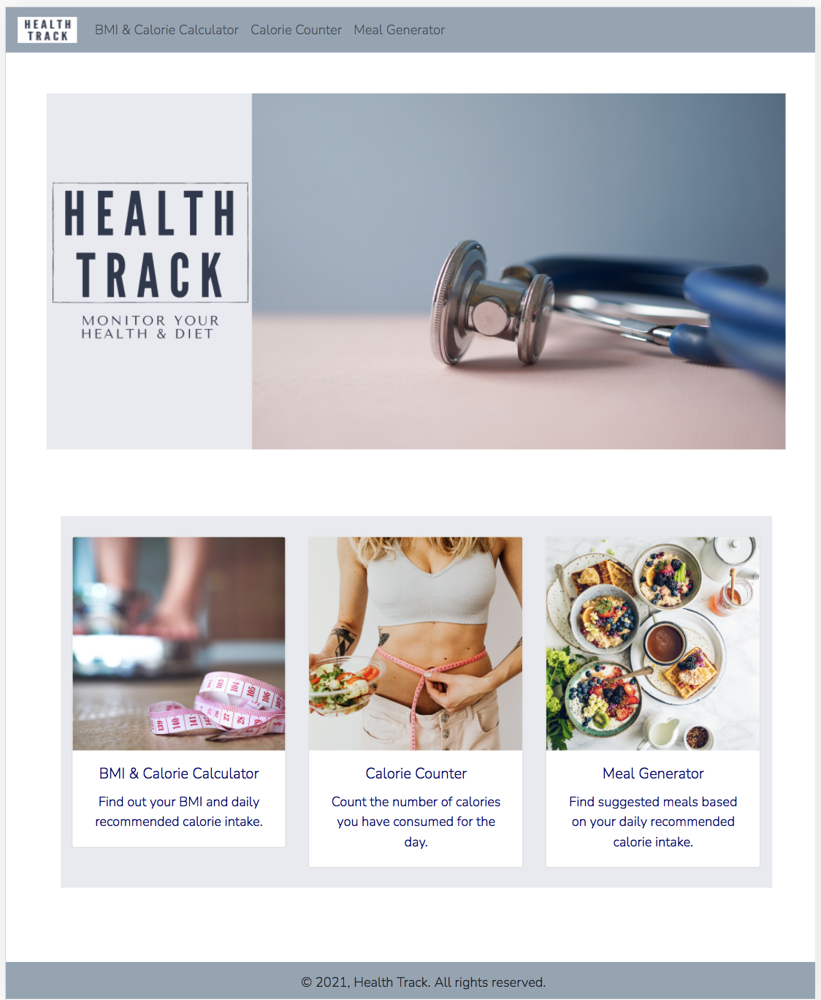

# Interactive Front-End Development - Milestone Project 2

 
### A website to monitor an individual's health and diet

# Table of Contents
1. Background
2. Objectives
3. Demo
4. Adopted Technology
5. User Stories
6. Development
7. Implementation
8. Testing
9. Deployment
10. Acknowledgement

# 1. Background
Health Track is an interactive website targeted towards users who are health-conscious. The website allows the users to find out their BMI based on their height and weight, their recommended daily calorie intake based on their age and level of activeness, monitor their calorie intake for the day, and also suggest to them some dishes that they can prepare themselves and consume based on their recommended daily calorie intake. The website will be able to assist the users in their journey to maintain a healthy lifestyle.

# 2. Objectives
* To complete Milestone Project 2 - Interactive Front-End Development.
* To build an interactive website that is able to receive user input and process the data to generate an output that is useful for the user.
* To assist health-conscious users who need to monitor their calorie intake.

# 3. Demo
View the end product: [Health Track](https://farhansam.github.io/health_track/)

# 4. Adopted Technology
* HTML/CSS
* Bootstrap v4.1.x
* Javascript/jquery
* Postman & RapidAPI (for APIs)
* Stackoverflow
* Canva
* Github

# 5. User Stories
The target audience for the website are health-conscious individuals who are interested to monitor their current state of general health and their calorie intake. Some of the user stories are:

1. I want to know my BMI to gauge whether I am in the healthy range
2. I want to know my recommended calorie intake in order to gain/maintain/lose weight
3. I want to know how many calories I have consumed today
4. I want to know if I exceeded my recommended calorie intake for the day
5. I want a recommendation of dishes that I can eat based on my recommended calorie intake
6. I want to know how the dishes look like
7. I want to know the recipe for these dishes

# 6. Development
Wireframe for respective webpages:

1. Main landing page
   

2. BMI & Calorie Intake Calculator
   

3. Calorie Counter
   

4. Meal Generator
   

Wireframe for Website Structure
   


# 7. Implementation
Screenshot of actual webpages:

1. Main landing page
   <br>
   The main page serves to be the central page that connects to all other pages.
   

2. BMI & Calorie Intake Calculator
   <br>
   This page serves to answer to following user stories:
   ```
    1. I want to know my BMI to gauge whether I am in the healthy range
    2. I want to know my recommended calorie intake in order to gain/maintain/lose weight
    ```
   
   <br>
   The BMI results and recommended calorie intake will only pop up when user click on the "calculate" button. Also, a disclaimer to refer to a professional is included, as a safety precaution.

3. Calorie Counter
    <br>
   This page serves to answer to following user stories:
   ```
    3. I want to know how many calories I have consumed today
    4. I want to know if I exceeded my recommended calorie intake for the day
    ```
   
   <br>
   The calorie target, consumed and remaining section will only appear when the "set" button is clicked. The consumption of the user will be appended into a table when user clicks the "add to list" button. This will enable them to keep track of what they have consumed. There is a "reset all" button to allow user to reset all inputs in case they entered the wrong information.


4. Meal Generator
   <br>
   This page serves to answer to following user stories:
   ```
    5. I want a recommendation of dishes that I can eat based on my recommended calorie intake
    6. I want to know how the dishes look like
    7. I want to know the recipe for these dishes
    ```
   
   <br>
   When user clicks on "generate" button, the 3 meals will appear in a table form, and there will be photos as well as links to the recipe included for user to find out more details.


# 8. Testing

## Test Table

| Test Type | Test | Result | Error Fix |
|:---------:|:-------------:|:-------------:|:-------------:|
| Functionality | Test navbar links among all pages | All links work | NA |
| Functionality | Test links on cards in main page | All links work | NA |
| Functionality | Test API endpoints | Endpoints work as expected | NA |
| Usability | Test API endpoints that may not exist in API database, ie; local Singaporean dishes | Endpoint does not exist. No data retrieved. | Display alert message in UI. If endpoint does not exist, alert message will pop up, informing user that the dish is not found in the "library" |
| Functionality | Test appended table in calorie counter page | Table row appended from the top instead of the bottom | Targeted wrong DOM tree in JS. Rectified by specifying ID |
| Usability | Test BMI & recommended calorie intake formula. Counter checked with physical calculator. | Returns different number from physical calculator | Syntax error in code. Rectified by correcting the syntax |
| Usability | Test user input validation by entering unwanted characters and numbers in input field | Input field accepted unwanted characters and numbers | Accepted characters for input field was not defined in JS file. Rectified by defining the wanted/unwanted characters for each input field |
| Responsiveness | Test responsiveness of navbar collapse using Google Chrome inspect element | Navbar able to collapse in small screen and expand when the collapse button is clicked | NA |
| Responsiveness | Test responsiveness of images and columns using Google Chrome inspect element | Images are resized and columns are restacked | NA |


## Bug Testing
### HTML
All HTML pages passed through W3C Nu HTML. Errors were rectified.
    
    

### CSS
   CSS file passed through Jigsaw CSS. Errors were rectified.
   

### Javascript
   Javascript file was passed through JSHint Validator. No major issues found.
   

### API
   APIs were tested on Postman for the workability of the endpoint
   


# 9. Deployment
The website was deployed through Github pages.
* Link to published website: (https://farhansam.github.io/health_track/)
* Link to source code: (https://github.com/farhansam/health_track)

# 10. Acknowledgement
* Trent Global College for providing the platform for learning.
* Code Institute for their TAs, namely:
  * Malcolm Yam
  * Shun
  * Paul Chor
  * Arif Rawi
* [Rapid API](https://rapidapi.com/)
  * Spoonacular (Meal & recipe generator)
  * Calorie Ninjas (Calorie information)
* [Stackoverflow](https://stackoverflow.com/) for coding tips
* [diabetes.co.uk](https://www.diabetes.co.uk/bmr-calculator.html) for the recommended calorie intake formula
* [Canva](https://www.canva.com/) for images used in the website.
* [Bootstrap](https://getbootstrap.com/) for HTML and CSS templates.
* [w3schools](https://www.w3schools.com/) for basic HTML/CSS/Javascript/Jquery syntax references.